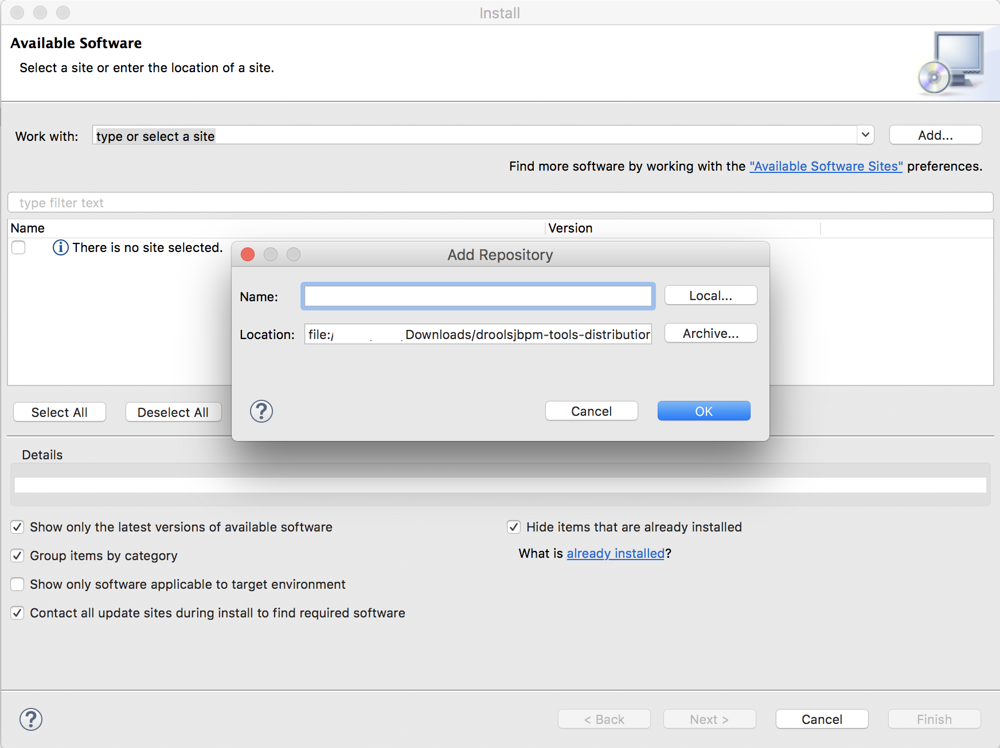
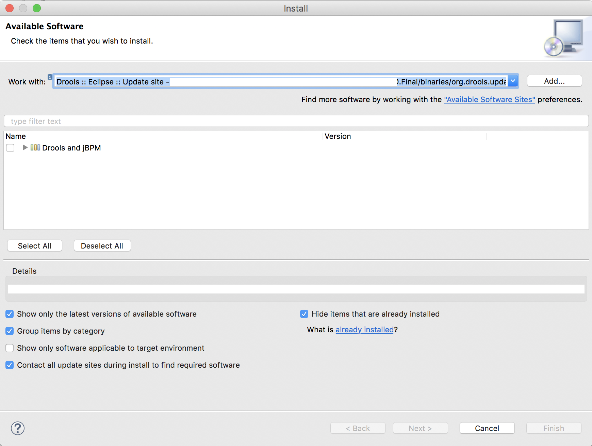

# Drools Hello World

## Prerequisites

### Eclipse Plug in

 - download Drools release [here](http://download.jboss.org/drools/release/6.5.0.Final/)
 - Extract the zip file in the target installation directory
 - Go to eclipse Help -> Install New Software
 
  { width=50% }
  { width=50% }
  
 