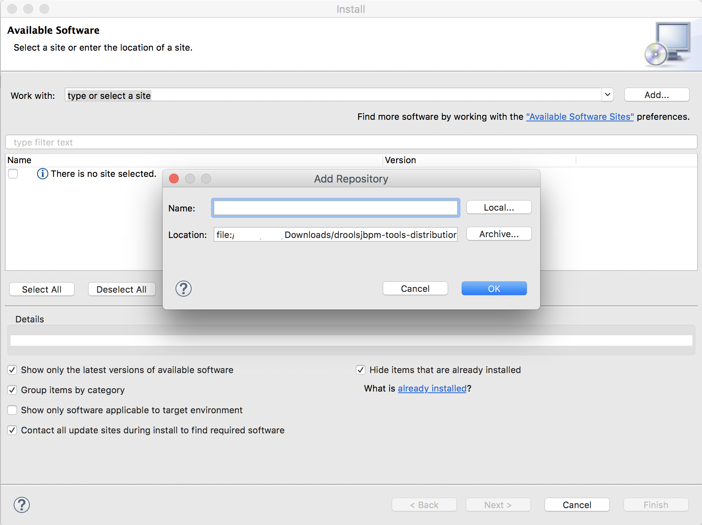
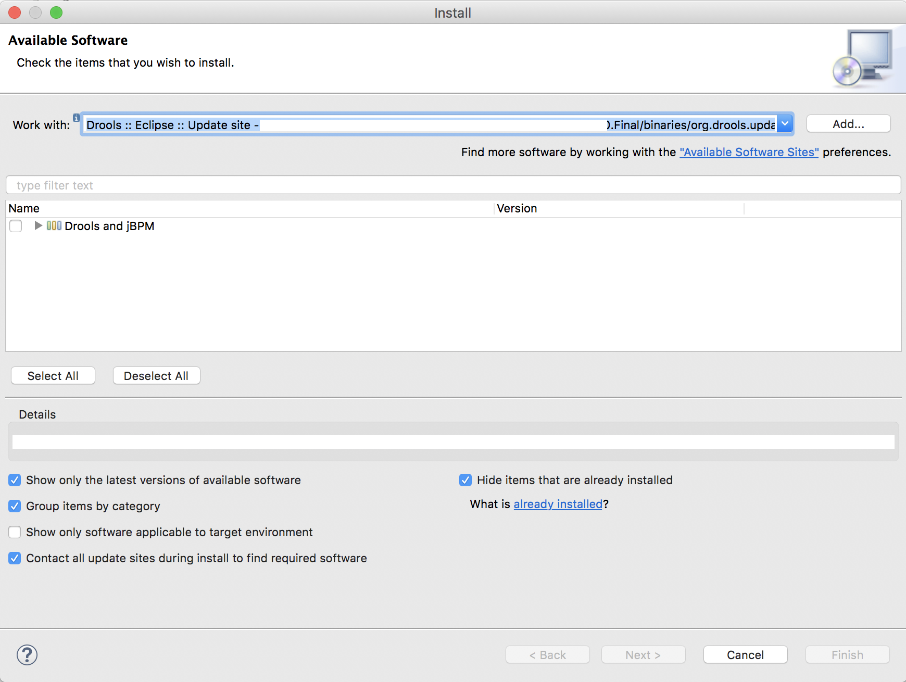
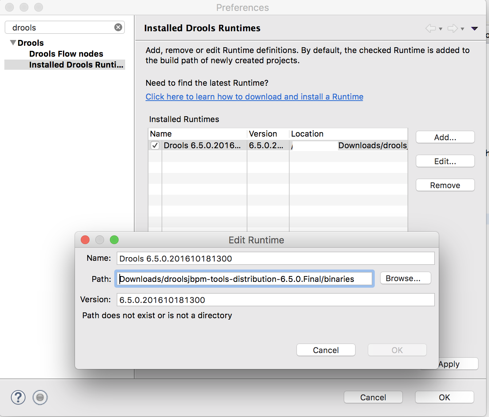

# Drools Hello World

## Prerequisites

### Eclipse Plug in

 - Download Drools release [here](http://download.jboss.org/drools/release/6.5.0.Final/)
 - Extract the zip file in the target installation directory
 - load Eclipse
 -  Click on Help → Preference → Drools → Installed Drools Runtime. Then click on Add as shown in the following screenshot.
  
  - click on Local as shown here and select "…/binaries/org.drools.updatesite".
  
  
  
  - then continue the installation as usual in eclipse
  - system will ask you to restart.
  - Once restart go to Eclipse → Preferences, Type Drools in Filer and add the runtime as shown below
  
    
    
   %%%% test %%%%